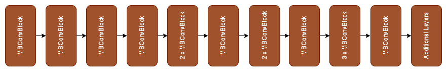
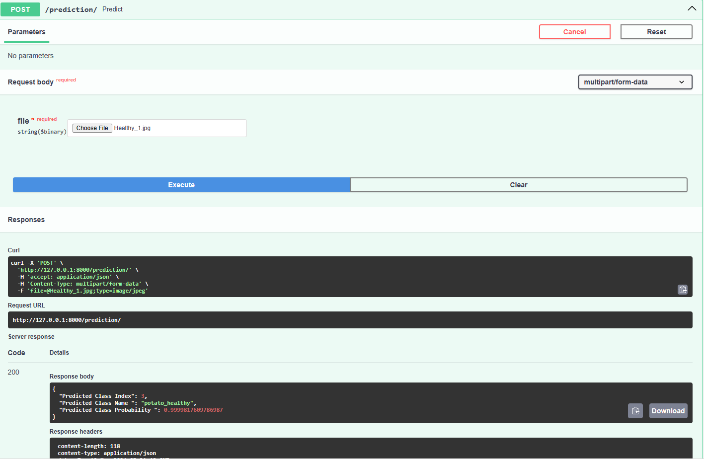

# Plant Disease ONNX and Fast API
## Overview

Agriculture plays a vital role in ensuring food security and sustaining global economies. However, the agricultural sector faces a persistent threat in the form of plant diseases that can lead to significant crop losses. The urgency of developing an effective plant disease classification system stems from the following critical factors:

Early detection and intervention are crucial to prevent widespread crop damage and mitigate economic losses.

Detecting and managing plant diseases promptly contributes to sustainable farming by reducing the need for excessive pesticide use and minimizing environmental impact.

Advancements in technology, particularly in the field of deep learning and computer vision, provide us with the tools to revolutionize disease detection processes

## Model Architecture

The model using Efficient Net Model and 1 additional layers.



## Pre-requisite Packages

- **Python** : You need to install Python 3.9 or later
- **IDE**    : You need to install an IDE to run the program, I recommend you to install VS Code
- **Library**: To run this program you need to install requirements.txt.

## Installation

1.  Clone this repository to your local device using `git`:
    ```
    git clone https://github.com/widyamsib/plantdisease-onnx-fastapi.git
    ```
2.  Change your terminal into the new subdirectory:
    ```
    cd plantdisease-onnx-fastapi
    ```
3.  Then open in Visual Studio Code:
    ```
    code .
    ```
4.  If the Python requires a virtual environment, create and activate the virtual environment in the terminal
    ```
    python -m venv venv
    .\venv\Scripts\activate
    ```
5.  Install project depedencies using:
    ```
    pip install -r requirements.txt
    ```

## Convert PyTorch Model to ONNX

1.  Ensure you have the required depedencies installed.

2.  Run the command below in the ```converter.py``` file.

    ```
    python converter.py
    ```

3.  The script will export the PyTorch model to ONNX format.

## Testing

If you want to see how the program goes in action and how the model performed in FastAPI, follow these steps:

1. Make sure you fulfill all the requirements mentioned in the ```requirements.txt```

2. Run this command to run file ```running.py```

```
python running.py
```

3. After running the ```running.py``` file, you can access FastAPI at ```http://127.0.0.1:8000/docs``` to test the model prediction endpoint.

## Prediction




